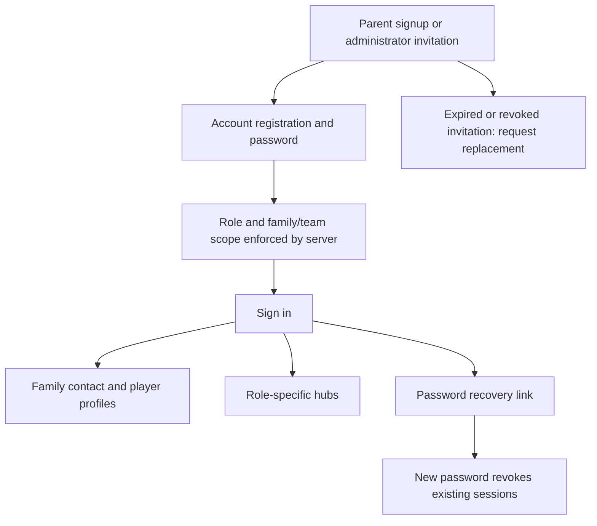
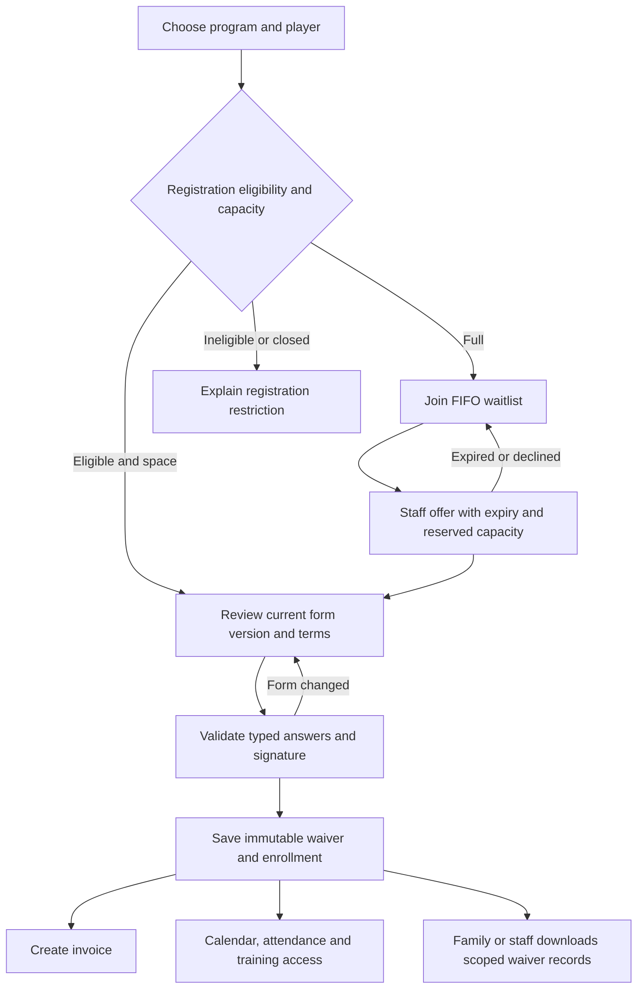
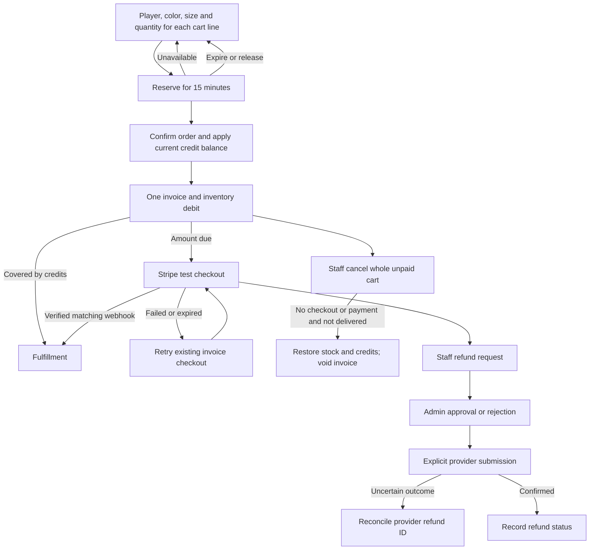
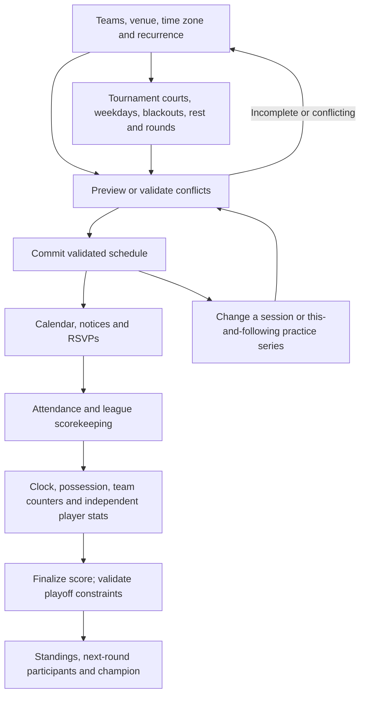
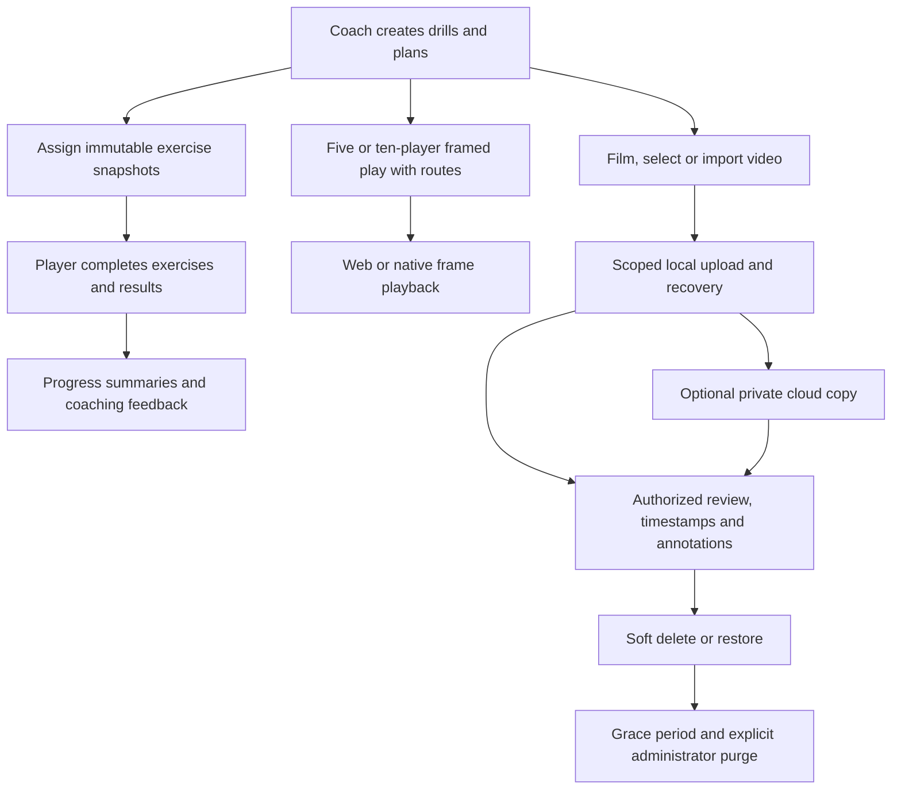
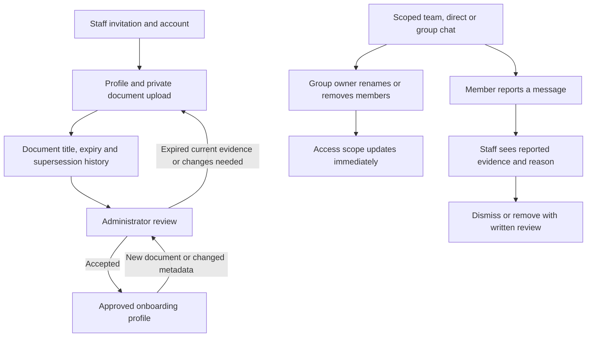
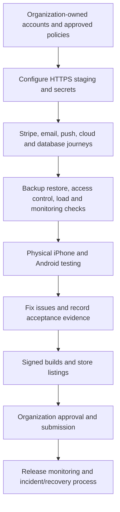

# Design and workflow handoff — October 4, 2026

Status: draft for organization review. Existing coded branding follows the supplied website reference. No organization approval or native Figma project has been obtained. Import [the editable SVG board](public/design-system.svg) into Figma as a starting point; it is not a replacement for a published Figma component library. Source typography and tokens are in `src/brand.css`; functional layouts remain in the React and React Native source.

## Design acceptance

- Confirm permission to use the current logo/photos and approve the sky-blue, charcoal and white identity.
- Approve desktop sidebar, mobile Home/Schedule/Chat/More navigation and role-specific screens.
- Create native Figma components/variants from the import board: buttons, forms, cards, tables, dialogs, notices, charts and courts. Add focus, error, loading, empty and disabled states.
- Review readable contrast, 48px mobile actions, 16px input text, accessible labels and keyboard/screen-reader behavior on actual devices.
- Approve final copy, waiver wording, credit policy, cancellation/refund policy, document requirements and competition rules separately.

## Accounts and family profiles

## Registration, waivers and waitlists

## Store, payment and refund

## Scheduling and league management

## Training, playbook and media

## Staff onboarding and moderation

## Launch and operational acceptance

These diagrams describe the implemented workflow and intended launch gates. Provider-backed stages remain pending real configuration and acceptance testing. Advanced native provider operations still use the web administrator workspace.
